*This project has been created as a part of the 42 curriculum by [csenelle](https://github.com/Kamisenin), [nrolland](https://github.com/nrollandd), [jmassavi](https://github.com/Djo-msv), [humontas](https://github.com/Diremii) and [thcaquet](https://github.com/Jainek0)*

<span style="font-size: 40px;">**42chan (ft_transcendence)**</span>

# Description

42chan is a collaborative wiki platform inspired by fandom-style knowledge bases, but with a stronger emphasis on structured organization, permission management, and editorial control. The project was designed to solve a common wiki problem: a page may contain valuable information, but without a proper taxonomy, classification system, and access control, content becomes hard to discover, maintain, and govern.

The platform combines a rich content editor, customizable permissions, tag and organization hierarchies, notifications, authentication, and search/recommendation systems. It is built as a full-stack application with a modern Next.js frontend, PostgreSQL database, and supporting Python microservices for search and recommendation.

A central idea of the project is that pages are not standalone documents: they belong to tag ecosystems, organization structures, and editorial flows. That is why the architecture heavily focuses on permission propagation, role-based governance, and content discoverability.

---

## Overview

42chan sits between a fandom wiki and a traditional encyclopedia: users can create pages, tag them, request access to new classifications, delegate responsibilities to tags and organizations, and manage the editorial lifecycle of their content.

The project revolves around a few core concepts:

- Pages: writable, richly structured wiki entries.
- Tags: thematic categories used to classify pages and grant access through roles.
- Organizations: umbrella groups that centralize permission rules across multiple tags and pages.
- Roles: hierarchical permission systems for users, tags, and organizations.
- Requests: workflows for tag/page approval and grants.
- Notifications: event-driven updates for edits, requests, and friendships.

This creates a strong wiki governance model: a user may own a page, a friend may be granted write access, a tag maintainer may be able to manage certain permissions, and an organization may enforce consistent rules across multiple communities.

The system is designed to match real-world knowledge management problems rather than simple static article publishing.

---

# Installation and Setup

## Prerequisites

The following tools must be installed on the host machine before working on the project:

| Tool | Minimum Tested Version | Purpose |
|------|------------------------|---------|
| Docker Engine | 20.10+ | Container runtime |
| GNU Make | 3.81+ | Build automation through the project Makefile |
| NPM | 11.13.0+ | Dependency installation for the Node.js app |
| Next.js | 16.2.9+ | Development and runtime for the frontend |
| Prisma | 7.8.0+ | Database schema management and client generation |
| Git | — | Version control |

Ensure the Docker daemon is running before executing any command:

```bash
sudo systemctl start docker
```

---

## NPM installation

Install Node.js and npm using nvm:

```bash
curl -o- https://raw.githubusercontent.com/nvm-sh/nvm/v0.39.7/install.sh | bash

export NVM_DIR="$HOME/.nvm"
[ -s "$NVM_DIR/nvm.sh" ] && \. "$NVM_DIR/nvm.sh"

nvm install --lts
nvm use --lts
```

Verify the installation:

```bash
node -v
npm -v
```

Then inside the project, install dependencies:

```bash
cd srcs/next
npm install
```

---

## Required secrets

All of the following files must be placed inside the `/secrets/` directory at the root of the project:

```bash
db_root_pwd.txt        # password of the PostgreSQL root user
db_website_pwd.txt    # password of the project database user
gmail_app_pwd.txt     # Gmail application password for automated emails
gmail_user.txt           # Google account associated with the project
```

### Gmail configuration

To obtain a Gmail App Password:

1. Open your Google Account.
2. Go to Security.
3. Enable 2-Step Verification if not already enabled.
4. Create an App Password for the project.
5. Copy the generated password into the `gmail_app_pwd.txt` secret.

---

## How to run the project

From the repository root, the project is managed with the Makefile:

| Target | Command | Description |
|--------|---------|-------------|
| `upb` | `make upb` or `make` | Build all Docker images and start every service |
| `build` | `make build` | Build all images without starting containers |
| `up` | `make up` | Start services in the foreground |
| `down` | `make down` | Stop the running services |
| `clean` | `make clean` | Stop services and prune unused Docker images |
| `fclean` | `make fclean` | Full teardown including volumes and orphaned resources |
| `re` | `make re` | Full clean + rebuild |

For local development with hot reload, use:

```bash
make MODE=dev upb
```

This will activate the development configuration and allow the Next.js app to run with live reload.

---

### Database initialization

If this is the first time the application is started, or if Prisma schema changes were made, the database must be synchronized.

First, start the **database container**, then export the correct `DATABASE_URL` environment variable. The simplest option is to copy the relevant lines from `dev_start.sh` at the repository root.

Execute
```bash
npx prisma generate
```

Then run one of the following commands from `srcs/next`:

```bash
npx prisma db push
```

or, for migration-based setup:

```bash
npx prisma migrate dev --name init
```

> Warning: `db push` destroys current data in the database if it already exists. Use it only on a fresh or disposable database.

---

# Team organization

**Product Owner:** csenelle  
**Project Manager:** jmassavi  
**Technical Lead:** humontas  
**Developers:** csenelle, nrolland, jmassavi, humontas, thcaquet

## Project management

The team initially tried GitHub Projects, but the workflow was too rigid for the needs of the project. We then moved to a lighter planning approach using Google Docs for roadmap tracking, architecture decisions, module planning, and task coordination.

## Communication

Most of the communication happened on Discord, through a dedicated project server and private team channels.

---

# Features list

### Core platform features

- [x] Customizable wiki editor — csenelle, jmassavi  
  Rich text editing built with Slate.js combined with a grid-like layout system. Users can structure page content into multiple blocks and rearrange editorial components dynamically.

- [x] Image upload and media management — jmassavi  
  Users can upload images for page content, view uploaded assets, and manage their media library in the platform.

- [x] Page, tag, and organization management — csenelle  
  Each object supports ownership, request flows, permissions, and granular role-based governance.

- [x] Search engine — humontas  
  A dedicated fuzzy search service indexes page metadata and ranks results using tag relevance, title similarity, and language-aware preprocessing.

- [x] Automated testing — humontas  
  Test coverage for core functionality such as authentication, permissions, and page behavior.

- [x] User management, authentication, GDPR compliance — nrolland  
  Registration, login, session handling, password management, email verification, account deletion, and security features such as 2FA.

- [x] Recommendation system — thcaquet  
  A machine learning-inspired recommendation API based on tag vectors and cosine similarity to suggest relevant pages.

- [x] Localization and language management — humontas  
  The application supports multiple interfaces and translations for a more accessible user experience.

- [x] Notifications system — humontas  
  Real-time structured updates for page edits, friendship requests, and administrative activities.

- [x] Friendship and social connectivity — nrolland, humontas  
  Users can send, accept, reject, and manage friendship requests, with notification integration and account-level activity awareness.

- [x] Role and permission governance — csenelle  
  Complex access control with per-page, per-tag, and per-organization permission propagation.

- [x] Secure session and account lifecycle — nrolland  
  User sessions are tracked with expiration and IP metadata, and account-related actions are enforced with verification and validation.

- [x] Organization System — csenelle
  A multi Organization system, allowing users to easily manage pages and tags

---

# Technical stack

## Frontend

- Next.js 16
- React 19
- TypeScript
- Tailwind CSS
- shadcn UI primitives
- lucide-react icon set
- Slate.js for rich-text editing
- Yjs for collaborative content synchronization concepts
- React Grid Layout for dynamic page block composition

### Why these choices were made

The frontend uses Next.js because the project required a single full-stack framework with SSR capabilities, structured routing, and server-side integration. React and TypeScript made the permission-heavy UI safer and easier to maintain. Slate.js was chosen because the editor needed structured rich text, not a simple textarea. React Grid Layout was necessary to support dynamic page composition and reusable editorial blocks.

## Backend

- Node.js and Next.js server actions
- Prisma ORM
- PostgreSQL database
- bcrypt for password hashing
- nodemailer / Resend for automated emails
- FastAPI for the custom search service
- Python for recommendation generation
- Docker Compose for orchestration

### Why these choices were made

The backend is centered around the idea that the application is not just a simple CRUD site: it needs permission logic, role hierarchies, request workflows, notifications, and user management in a structured and predictable way. Prisma allowed fast schema evolution and type-safe database access in TypeScript. PostgreSQL was chosen because it supports relational modeling for complex permissions and tag relationships. FastAPI was used for the search engine because low latency, structured JSON APIs, and Python-based NLP processing were a natural fit.

## Database system and design rationale

PostgreSQL was selected because the product is fundamentally relational:

- users own pages, tags, and organizations;
- pages are linked to many tags;
- roles and permissions are hierarchical;
- requests and approvals must be tracked as records;
- notifications and friendships depend on consistent relational integrity.

A NoSQL database would not fit this permission graph nearly as cleanly as a relational system with foreign keys and transactional updates.

---

# Database schema

The database is centered on users, pages, tags, organizations, permissions, requests, notifications, and social relationships.

```mermaid
erDiagram
    USER ||--o{ SESSION : has
    USER ||--o{ FRIENDSHIP : sends_or_receives
    USER ||--o{ PAGE : owns
    USER ||--o{ PAGE_PERMISSION : receives
    USER ||--o{ TAG : owns
    USER ||--o{ TAG_MEMBER : belongs_to
    USER ||--o{ TAG_PERMISSION : has
    USER ||--o{ ORGANIZATION : owns
    USER ||--o{ ORGANIZATION_MEMBER : belongs_to
    USER ||--o{ NOTIFICATION : receives
    USER ||--o{ USER_TAG_INTEREST : tracks

    PAGE ||--o{ TAG_PAGE : tagged_as
    PAGE ||--o{ PAGE_PERMISSION : has_access
    PAGE ||--o{ PAGE_REACTION : receives
    PAGE ||--o{ PAGE_SLUG : has
    PAGE ||--o{ TAG_PAGE_REQUEST : requests
    PAGE ||--o{ ORG_PAGE_REQUEST : requests
    PAGE ||--o{ NOTIFICATION : triggers

    TAG ||--o{ TAG_ROLE : defines
    TAG ||--o{ TAG_MEMBER : members
    TAG ||--o{ TAG_PAGE : contains
    TAG ||--o{ TAG_PERMISSION : grants
    TAG ||--o{ TAG_PAGE_REQUEST : requests
    TAG ||--o{ TAG_STATISTIC : tracks
    TAG ||--o{ ORG_TAG_REQUEST : requests

    ORGANIZATION ||--o{ ORGANIZATION_ROLE : defines
    ORGANIZATION ||--o{ ORGANIZATION_MEMBER : has_members
    ORGANIZATION ||--o{ ORG_TAG_ACCESS : manages
    ORGANIZATION ||--o{ ORG_PAGE_ACCESS : manages
    ORGANIZATION ||--o{ ORG_TAG_REQUEST : reviews
    ORGANIZATION ||--o{ ORG_PAGE_REQUEST : reviews

    TAG_ROLE ||--o{ TAG_PAGE_ACCESS : minimum_role
    TAG_ROLE ||--o{ TAG_PAGE_CAPABILITY : capability
    ORGANIZATION_ROLE ||--o{ ORG_PAGE_ACCESS : minimum_role
    ORGANIZATION_ROLE ||--o{ ORG_TAG_ACCESS : minimum_role
```



## Key entities and relationships

### Users
Users are the central identity model. They own pages, tags, and organizations, manage sessions, verify emails, and hold permissions directly or through group memberships.

### Pages
Pages store the content, metadata, owner, last editor, visibility, and slug information. They support permission control and reactions.

### Tags
Tags classify pages and act as a governance unit. They can have multiple roles, permission sets, and membership relationships. Tags are designed to represent communities or subject-specific editorial groups.

### Organizations
Organizations aggregate multiple tags and roles into a single governance layer. Their purpose is to avoid duplicated permission management across different tag clusters.

### Permission and request models
The application contains explicit permission tables for:

- page permissions;
- tag permissions;
- tag-role-to-page access;
- organization-to-tag access;
- organization-to-page access;
- request review workflows for tags and pages.

These tables are crucial because the app is built around delegated editing, approval chains, and multi-level access control.

### Notifications and reactions
The notification system tracks events such as page edits and friendship events. Reactions allow users to favorite or dislike a page and contribute to recommendation learning.

### User tag interests
This table stores the user profile vector used by the recommendation engine. It allows the system to match users with pages based on historical tag affinities.

---

# Modules

## Chosen modules and score

| Module | Type | Points | Team member(s) |
|--------|------|--------|----------------|
| Full-stack framework (Next.js) | Major | 2 | csenelle, humontas, jmassavi |
| Notification system | Minor | 1 | humontas |
| SSR / SEO friendly rendering | Minor | 1 | humontas, csenelle |
| File upload and media management | Minor | 1 | jmassavi |
| ORM usage | Minor | 1 | humontas, jmassavi |
| Multi-language support | Minor | 1 | humontas |
| Support for additional browsers / compatibility | Minor | 1 | humontas, jmassavi |
| Standard user management and authentication | Major | 2 | nrolland |
| Advanced permissions system | Major | 2 | csenelle |
| Organization system | Major | 2 | csenelle |
| 2FA | Minor | 1 | nrolland |
| Recommendation system using machine learning | Major | 2 | thcaquet |
| Multilingual real-time search engine | Major | 2 | humontas |
| Custom collaborative wiki editor | Minor | 1 | csenelle, jmassavi |

Total: 20 points

---

## Module justifications

### Major: Multilingual Real-Time Search Engine

This module was chosen because a wiki platform is only as useful as its ability to surface the right content quickly. In a knowledge base where pages are categorized with tags, titles, and descriptions, naive substring matching is not enough. Users expect search to tolerate spelling errors, language variations, and imperfect tag names while still returning relevant results with low latency.

#### Why we chose it

The project is built around a community-driven taxonomy. Users create pages, tags, and cross-links without a central editorial team. That makes discoverability a core design challenge. A static search-only on page titles would be too weak for the project, especially with multilingual content and fuzzy tag names.

#### Technical challenges it addresses

- Query normalization across multiple languages.
- Stemming and stop-word filtering for better matching quality.
- Relevance scoring combining title similarity and tag similarity.
- Fuzzy search over tag names and metadata.
- Fast response time from a dedicated Python microservice.
- Ranking logic that suppresses weak matches while preserving relevant ones.

#### How it was implemented

The search engine is implemented as a dedicated FastAPI service. It receives user queries and page metadata, preprocesses the text, computes per-page scores, and returns ranked results. The custom scoring pipeline combines:

- tag relevance evaluation;
- title similarity scoring;
- language-aware preprocessing;
- threshold filtering;
- top-N result selection.

The service runs independently from the web app, which keeps the frontend responsive and prevents search logic from becoming a bottleneck.

#### Why it deserves Major module status

This is not a trivial keyword filter. It requires NLP preprocessing, ranking heuristics, microservice integration, and performance tuning. It directly improves the usability of the wiki at scale and is a substantial technical subsystem that adds real value to the product. For that reason, it qualifies as a major custom module.

---

### Minor: Custom collaborative wiki editor

This module was selected because the platform is fundamentally a wiki, and a wiki becomes genuinely useful only when writing and structuring content is efficient. We did not want a static page editor with a single plain text field; this project needed a richer, more modular editing experience.

#### Why we chose it

The project deals with structured pages that may include headings, blocks, images, descriptive metadata, and editorial organization. A simple text editor would not be enough for collaborative and customizable pages. We needed a writing system that supports content composition, visual layout, and future extensibility.

#### Technical challenges it addresses

- Rich-text editing within a complex interface.
- Multiple editable blocks on a single page.
- Dynamic layout composition and rearrangement.
- Maintaining clean content structure while allowing flexible page design.
- Managing a visual editor in a framework designed for data-heavy interfaces.

#### How it was implemented

The editor is built using Slate.js and React Grid Layout, with a dynamic content model designed for page composition. The system supports multi-section page editing and allows users to construct a more flexible editorial experience than a standard Markdown or plain-text field.

This matches the project’s nature: pages are not only documents, they are structured knowledge surfaces that need visual organization and maintainability.

#### Why it deserves minor module status

This feature is smaller in scope than the full search engine, but it still demonstrates real technical skill. It adds meaningful value by making content creation more powerful and more expressive than a basic wiki form. It is not simply a cosmetic editor; it is a concrete editorial system aligned with the project’s purpose.

---

## Additional notes on module design

The custom modules were not added arbitrarily. They address specific pain points in a wiki platform:

- search ensures discoverability;
- the editor ensures content creation quality;
- permissions ensure editorial safety and governance;
- notifications keep the community synchronized.

This combination makes the project more than a simple page database. It becomes a working knowledge-management system with editorial workflows, social interaction, and scalable relevance.

---

# Resources

- [Next.js Documentation](https://nextjs.org/docs)
- [Prisma Documentation](https://www.prisma.io/docs)
- [PostgreSQL Documentation](https://www.postgresql.org/docs/)
- [FastAPI Documentation](https://fastapi.tiangolo.com/)
- [Slate.js Documentation](https://docs.slatejs.org/)

- AI usage : For this project AI was used as documentation purposes as well as a major help with the front-end and creating this readme
